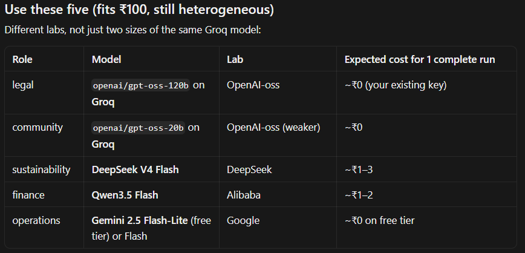

# SocietyXAI — Project Document

**Paper working title:** causal explainability of belief dynamics and consensus in multi-agent LLM societies.

This file is the full record of what the project is, what was built, what was removed, and **every live experiment run so far**. Turn-by-turn transcripts live in [`societyxai/docs/EXPERIMENT_LOG.md`](../societyxai/docs/EXPERIMENT_LOG.md). Machine traces live in [`societyxai/runs/`](../societyxai/runs/).

Date of this write-up: **24 August 2026**.

---

## 1. What the project is

SocietyXAI studies how a small society of LLM agents **forms, shifts, and locks beliefs** on a high-stakes yes/no decision. The product angle is an **audit of thinking quality**, not a second “judge” model:

- each agent holds a position (`support` / `reject`), a confidence, cited evidence, and a short reasoning trace
- the society talks on a **complete topology** (everyone can see prior messages, confidence, and the current majority)
- the orchestrator is code: visibility filters, speaker order, interventions, parsers, majority vote vs ground truth
- **no judge LLM**. The only models are the agents themselves

Four case-study niches, taken from the original plan ([`original-plan.pdf`](original-plan.pdf)):

| Niche | Architecture | Decision |
|---|---|---|
| Healthcare | specialist consultation | steroids now vs wait for MRI |
| Legal | adversarial hearing | strike a non-compete or keep it |
| Finance | risk committee | aggressive long vs abort |
| ESG | stakeholder negotiation | terminate a supplier or keep the contract |

Each niche is run **homogeneous vs heterogeneous**, with **counterfactual interventions** (remove an agent, hide majority/confidence, reorder speakers, identity swap). This document records the complete-architecture Groq runs that have actually been executed.

---

## 2. What we did until now

### 2.1 Two codebases, then one

1. **Early prototype** (this workspace, mid-August 2026) lived under `src/societyxai/`. Groq + dummy backends, four scenario packs, an audit report. Groq later **retired** `llama-3.3-70b-versatile` and `llama-3.1-8b-instant`. That tree is **deleted** (see §8).
2. **Canonical engine** cloned from [nithu0602/societyxai](https://github.com/nithu0602/societyxai): YAML experiments, Ollama, topologies, interventions, traces, paper metrics, 350+ tests.
3. **Merge:** Groq backend, complete-topology YAML packs, markdown experiment log, position normalisation (`approve`/`yes` → `support`), env loading from `.env`.

The runnable project is **`societyxai/`**. Root `README.md` only points here.

### 2.2 Engine behaviour that matters for results

- YAML → `ExperimentLoader` → Society + Task + backend → `Orchestrator.run()`
- Per turn: topology visibility → Groq chat (JSON mode, 429 retries) → `StructuredBeliefParser` → `AgentTrace` + `MessageTrace`
- Agents listed in `adjudicator_ids` (treatment planner, judge, CIO) **speak only in the last round**
- Final decision = majority vote of last-round positions vs `ground_truth`
- Consensus score (paper metric): \(1 - (d-1)/(n-1)\) where \(d\) is the number of distinct final positions and \(n\) is the number of agents. Unanimous → **1.00**. One dissenter in a 5-agent panel → **0.75**

Live model after the Groq retirement:

| Slot | Model |
|---|---|
| Strong / default | `openai/gpt-oss-120b` |
| Weak (heterogeneous) | `openai/gpt-oss-20b` |

Tests after the merge: **359 passed**.

### 2.3 Live Groq experiments (this is the result set)

All six runs below used:

- provider `groq`
- temperature `0.2`, `max_tokens` 256
- topology **complete**
- visibility: previous messages **on**, confidence **on**, majority **on**
- seed `42`
- 2 rounds
- date **24 August 2026** (UTC timestamps on the JSON traces)

| # | Run | Architecture | Mix | Final | Correct | Consensus |
|---|---|---|---|---|---|---|
| 1 | Healthcare consultation | consultation | homogeneous 120B | **reject** (wait for MRI) | yes | **1.00** |
| 2 | Legal adversarial | adversarial | homogeneous 120B | **support** (strike non-compete) | yes | **0.75** |
| 3 | Finance committee | committee | homogeneous 120B | **reject** (abort the long) | yes | **1.00** |
| 4 | ESG negotiation | negotiation | homogeneous 120B | **support** (terminate) | yes | **1.00** |
| 5 | ESG minus finance | same + agent-removal | homogeneous 120B | **support** | yes | **1.00** |
| 6 | ESG heterogeneous | negotiation | 120B + 20B | **support** | yes | **1.00** |

6 / 6 majority-correct. The only incomplete consensus is **legal**: defence never flipped.

---

## 3. Example 1 — Healthcare consultation

**Config:** `societyxai/configs/experiments/complete_healthcare_consultation.yaml`  
**Trace:** `societyxai/runs/complete-healthcare-consultation.json`  
**Timestamp:** 2026-08-24T10:32:03Z

**Question.** Adult with sudden bilateral leg weakness and severe back pain. Osteoarthritis and neuropathy history. Imaging is not back. Start high-dose steroids now, or wait?

**Ground truth:** `reject` (wait for imaging unless a confirmed compressive protocol independently mandates steroids).

**Evidence.** Red-flag cord / cauda equina (e1); acute back pain with motor loss (e2); mixed evidence for steroids before imaging (e3); infection/fracture on the differential (e4).

**Cast (complete graph, 5 agents, 2 rounds).** GP and neurology specialist start **support**. Evidence analyst, risk officer, and treatment planner start **reject**. The treatment planner is the adjudicator and speaks only in round 2.

| Agent | Role | Initial | Round 1 | Round 2 (final) | Confidence |
|---|---|---|---|---|---|
| `gp` | general practitioner | support 0.62 | *parse failure* → recorded **neutral** 1.00 | **reject** | 0.74 |
| `specialist` | neurology specialist | support 0.70 | reject (empty parse, conf 1.00) | **reject** | 0.81 |
| `evidence_analyst` | evidence analyst | reject 0.58 | reject | **reject** | 0.73 |
| `risk_agent` | clinical risk officer | reject 0.74 | reject | **reject** | 0.86 |
| `treatment_planner` | chief treatment planner | reject 0.55 | *(silent)* | **reject** | 0.78 |

**Outcome.** Final **reject**, correctness **true**, consensus **1.00**. Both clinicians who began “treat now” moved to wait-for-MRI after seeing e3/e4 and the panel.

**Note on logging.** An earlier Groq attempt truncated JSON (`{"` only) and was retried. The JSON trace above is the completed run. Round-1 GP still lost a parse; the agent recovered in round 2.

---

## 4. Example 2 — Legal adversarial

**Config:** `societyxai/configs/experiments/complete_legal_adversarial.yaml`  
**Trace:** `societyxai/runs/complete-legal-adversarial.json`  
**Timestamp:** 2026-08-24T10:33:26Z

**Question.** Startup contract: two-year **statewide** non-compete plus assignment of all side-project IP. Strike the non-compete as unenforceable?

**Ground truth:** `support` (strike it).

**Evidence.** State limits/bans on overbroad non-competes (e1); off-hours IP assignment (e2); courts void statewide clauses without customer nexus (e3); employer claim of access to unreleased weights and customer lists (e4).

**Cast.** Prosecution (employee) starts support. Defence (startup) starts reject. Evidence analyst and precedent researcher start support. Judge starts reject and speaks only in round 2.

| Agent | Role | Initial | Round 1 | Round 2 (final) | Confidence |
|---|---|---|---|---|---|
| `prosecution` | employee counsel | support 0.82 | support 0.78 | **support** | 0.76 |
| `defence` | startup counsel | reject 0.78 | reject (empty parse in R1) | **reject** | 0.66 |
| `evidence_analyst` | evidence analyst | support 0.60 | support (empty parse in R1) | **support** | 0.73 |
| `precedent_researcher` | precedent researcher | support 0.66 | support 0.71 | **support** | 0.72 |
| `judge` | adjudicating judge | reject 0.50 | *(silent)* | **support** | 0.78 |

**Outcome.** Final **support**, correctness **true**, consensus **0.75** (4 support, 1 reject).

**What this example shows.** Majority and the judge moved to strike the clause. **Defence never flipped.** In round 2 it argued e4 + e2 (trade secrets + IP assignment justify the restriction). This is the only live complete architecture that did not reach unanimity. Adversarial role-lock survived full visibility of majority and confidence.

---

## 5. Example 3 — Finance committee

**Config:** `societyxai/configs/experiments/complete_finance_committee.yaml`  
**Trace:** `societyxai/runs/complete-finance-committee.json`  
**Timestamp:** 2026-08-24T10:35:38Z

**Question.** Ticker ACME, mixed sentiment after an SEC comment letter, 61% paper win rate on a bullish overlay. Execute an aggressive long?

**Ground truth:** `reject` (abort).

**Evidence.** SEC letter + mixed sentiment (e1); 61% paper win rate without costs (e2); paper stats omit gap/halt risk (e3); book already long cyclicals (e4).

**Cast.** Only **growth** starts support. Risk, portfolio, macro, CIO start reject. CIO speaks only in round 2.

| Agent | Role | Initial | Round 1 | Round 2 (final) | Confidence |
|---|---|---|---|---|---|
| `growth` | growth analyst | support 0.71 | reject (empty parse in R1) | **reject** | 0.71 |
| `risk` | chief risk officer | reject 0.84 | reject 0.86 | **reject** | 0.84 |
| `portfolio` | portfolio manager | reject 0.63 | reject 0.81 | **reject** | 0.78 |
| `macro` | macro economist | reject 0.60 | reject 0.75 | **reject** | 0.77 |
| `cio` | chief investment officer | reject 0.55 | *(silent)* | **reject** | 0.81 |

**Outcome.** Final **reject**, correctness **true**, consensus **1.00**. The sole bullish agent (growth) joined the abort. Round-2 reasoning consistently weighted e1/e3/e4 over the 61% backtest.

---

## 6. Example 4 — ESG negotiation (homogeneous)

**Config:** `societyxai/configs/experiments/complete_esg_negotiation.yaml`  
**Trace:** `societyxai/runs/complete-esg-negotiation.json`  
**Timestamp:** 2026-08-24T10:37:16Z

**Question.** Supplier Northwind Textiles promised zero discharge. Reports: chemical spill and unpaid overtime. Contract saves **$4.2M/year**. Terminate immediately?

**Ground truth:** `support` (terminate).

**Evidence.** Spill into a river (e1); unpaid overtime / blocked exit (e2); $4.2M savings vs next mill (e3); scorecard still “preferred”, no on-site audit this year (e4).

**Cast.** Sustainability, legal, community start **support**. Finance and operations start **reject**. No adjudicator — all five speak both rounds.

| Agent | Role | Initial | Final | Confidence |
|---|---|---|---|---|
| `sustainability` | sustainability officer | support 0.86 | **support** | 0.86 |
| `finance` | financial officer | reject 0.80 | **support** | 0.81 |
| `operations` | operations manager | reject 0.58 | **support** | 0.84 |
| `legal` | legal compliance | support 0.64 | **support** | 0.88 |
| `community` | community advocate | support 0.88 | **support** | 0.92 |

**Outcome.** Final **support**, correctness **true**, consensus **1.00**. Finance and operations **flipped** from keep-the-contract to terminate. Homogeneous 120B, complete visibility, two rounds.

---

## 7. Example 5 — ESG counterfactual (remove finance)

**Config:** `societyxai/configs/experiments/complete_esg_remove_finance.yaml`  
**Trace:** `societyxai/runs/complete-esg-negotiation-remove-finance.json`  
**Timestamp:** 2026-08-24T10:38:29Z

Same task and ground truth as Example 4. Intervention: **agent removal**, target `finance`. Four remaining agents, 8 turns.

| Agent | Final | Confidence |
|---|---|---|
| `sustainability` | support | 0.93 |
| `operations` | support | 1.00 |
| `legal` | support | 0.88 |
| `community` | support | 0.90 |

**Outcome.** Final **support**, correctness **true**, consensus **1.00**.

**Causal reading (this single pair).** Removing finance **did not change** the society decision. In the baseline, finance itself had already flipped to terminate. Finance was not a necessary cause of the terminate consensus on this seed. A fuller causal claim needs more seeds and other interventions (hide majority, reorder, identity swap).

---

## 8. Example 6 — ESG heterogeneous (120B + 20B)

**Config:** `societyxai/configs/experiments/complete_esg_heterogeneous.yaml`  
**Trace:** `societyxai/runs/complete-esg-heterogeneous.json`  
**Timestamp:** 2026-08-24T10:40:21Z

Same ESG terminate question. Model mix (still one lab, two sizes):

| Agent | Model | Initial | Final | Confidence |
|---|---|---|---|---|
| `sustainability` | gpt-oss-120b | support | **support** | 1.00 |
| `finance` | **gpt-oss-20b** | reject | **support** | 0.72 |
| `operations` | **gpt-oss-20b** | reject | **support** | 1.00 |
| `legal` | gpt-oss-120b | support | **support** | 0.78 then 1.00 |
| `community` | gpt-oss-120b | support | **support** | 1.00 |

**Outcome.** Final **support**, correctness **true**, consensus **1.00**.

The two weaker agents (finance, operations) still flipped to terminate. Round 1 had several empty parses (position recorded, reasoning blank); round 2 filled in. This run is **size diversity**, not **lab diversity**.

---

## 9. Planned next heterogeneous mix (not run yet)

The Groq 120B/20B mix is not a multi-lab society. The budget-constrained mix that **was chosen and kept** is this figure (original file also at [`../image.png`](../image.png)):



| Role | Model | Lab | Cost (one complete run) |
|---|---|---|---|
| legal | `openai/gpt-oss-120b` on Groq | OpenAI-oss | ~₹0 (existing key) |
| community | `openai/gpt-oss-20b` on Groq | OpenAI-oss, weaker | ~₹0 |
| sustainability | DeepSeek V4 Flash | DeepSeek | ~₹1–3 |
| finance | Qwen3.5 Flash | Alibaba | ~₹1–2 |
| operations | Gemini 2.5 Flash-Lite or Flash | Google | ~₹0 on free tier |

That mix is four labs, not two sizes of one Groq model. Estimated **one** complete debate: well under ₹100; a ₹500 cap is ample if thinking mode stays off.

### If the wallet is ~₹500 and we run **once**

Prefer **Sonnet 5** (not 4.6 — 4.6 is older and more expensive). Prefer **GPT-5.6 Luna** as the OpenAI slot (not GPT-4o / Sol / Terra). A 5-agent one-shot could be:

| Agent | Model |
|---|---|
| legal | Claude Sonnet 5 |
| finance | GPT-5.6 Luna |
| operations | Gemini 2.5 Flash |
| sustainability | DeepSeek V4 Flash |
| community | Qwen3.5 Flash |

Skip Opus 5, GPT-5 Sol/Terra, Grok flagship, Kimi K3 for this budget. **Not executed:** the repo currently only has a Groq key. DeepSeek / Qwen / Gemini / Anthropic / OpenAI backends are not wired in the loader yet (`ollama` and `groq` only).

---

## 10. Cross-example findings (so far)

1. **Complete topology + visible majority is strongly aligning.** Five of six runs ended unanimous.
2. **Correct majority is reachable from mixed initial beliefs** on these four vignettes with gpt-oss-120b.
3. **Role-locked dissent exists.** Legal defence kept `reject` against a 4–1 majority. That is the paper’s most useful live qualitative result so far.
4. **Agent-removal on ESG finance did not flip the decision** on seed 42. Do not over-claim “finance caused terminate.”
5. **Weaker 20B agents still followed** the ESG terminate consensus. Size mix ≠ independent lab mix.
6. **JSON parse failures are real.** gpt-oss sometimes emits truncated JSON; the parser records `neutral` or empty reasoning. Several agents recovered next turn. This belongs in limitations.
7. **Adjudicators** (planner, judge, CIO) only vote after hearing the panel. Judge moved from initial reject to support; CIO stayed reject with the committee.

These are **n = 1 seed** pilots, not a paper table. Replication needs more seeds, hidden-majority / reorder interventions, and a true multi-lab hetero run.

---

## 11. How to reproduce

```bash
cd societyxai
pip install -e .
python -m pytest -q
```

Put `GROQ_API_KEY` in the parent `.env` or `societyxai/.env`.

```bash
python -m societyxai run --config configs/experiments/complete_healthcare_consultation.yaml --log-doc docs/EXPERIMENT_LOG.md
python scripts/run_complete_architectures.py
```

| File | Purpose |
|---|---|
| `societyxai/configs/experiments/complete_*.yaml` | The six complete-architecture packs |
| `societyxai/docs/EXPERIMENT_LOG.md` | Every logged turn |
| `societyxai/runs/complete-*.json` | Validated traces |
| `societyxai/experiments/pilot_protocol.md` | Earlier Ollama minority-correct protocol (not the Groq complete runs) |

---

## 12. Repo layout after cleanup (24 Aug 2026)

```
ChocoMoco/
  README.md                 ← entry point
  image.png                 ← kept budget-mix figure (also under docs/figures/)
  .env / .env.example       ← secrets; never commit .env
  docs/
    PROJECT.md              ← this file
    original-plan.pdf       ← source research plan
    figures/heterogeneous-mix-budget.png
  societyxai/               ← canonical package, tests, configs, traces
```

**Removed as unnecessary**

| Path | Why |
|---|---|
| `src/societyxai/` | Superseded prototype |
| Root `tests/`, `examples/`, `artifacts/` | Belonged to that prototype (old llama-3.3-70b observe dumps) |
| `New folder/` | Unrelated agent sketches (`cheif_mo.py`, duplicate legal panels) |
| Root `pyproject.toml` | Installed the old `src/` package |
| `.pytest_cache/`, `runs/test-run.json` | Caches / dummy trace |

**Intentionally kept**

- Friend’s YAML pilots (homogeneous/heterogeneous minority, visibility toggles, speaker reverse) — they are part of the research design even if not Groq-complete.
- `societyxai/.git` — upstream history of the canonical engine.

---

## 13. What is still open

- Wire DeepSeek / Qwen / Gemini / Sonnet / Luna backends and run **one** multi-lab debate under the ₹500 cap.
- Repeat each architecture with hidden majority and speaker-order swap.
- More seeds; report false-consensus rate and minority recovery from `societyxai.utils.paper_metrics`.
- Reduce gpt-oss truncated-JSON failures (stricter JSON mode / retry on empty `reasoning_trace`).
